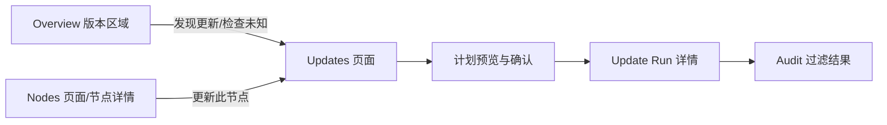
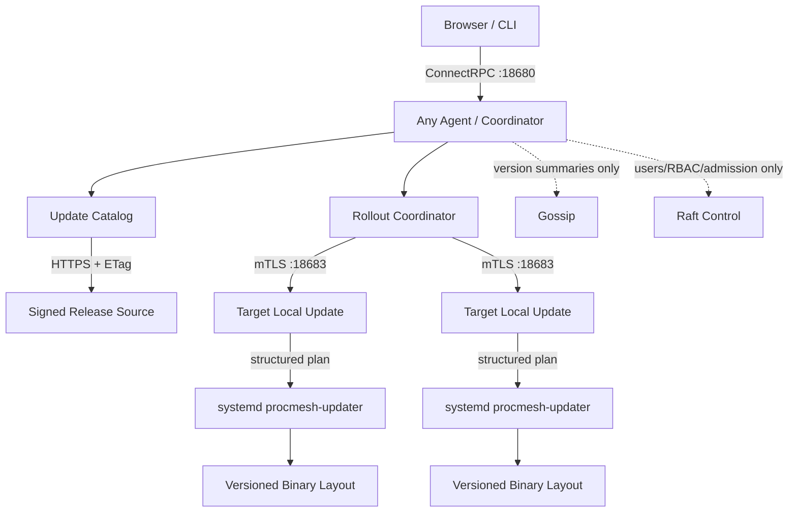
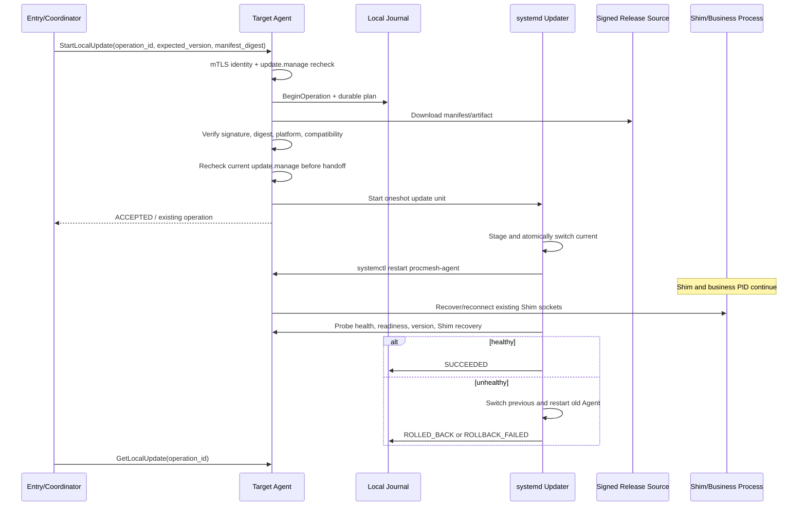

# ProcMesh Agent 自动更新产品需求与架构设计

日期：2026-08-30<br>
状态：范围已确认，待实施<br>
关联 Issue：PROC-18<br>
范围：Web 版本提示、单节点更新、整集群滚动更新，以及完成这些能力所需的发布、权限、安全、持久化和故障恢复机制。

本文是产品需求与总体架构合同，不是实施计划。实现前应按“研发与交付”章节拆分实施计划；涉及 `.proto`、Web 文案和 Linux systemd 行为时，分别遵循仓库现有生成、i18n 和平台测试约定。

---

## 1. 结论与关键决策

推荐把“自动更新”定义为：**Agent 自动检查新版本，管理员在 Web 明确确认后，由 ProcMesh 自动完成单节点或整集群滚动更新；MVP 不做无人值守定时安装。**

核心方案如下：

1. Overview 继续使用已有 `version_counts` 展示版本分布；新增服务端版本目录检查结果。有可安装的新版本时展示明确入口，点击进入 `/updates`，而不是在 Overview 直接执行高风险操作。
2. 新增独立的深模块 `internal/update`。其外部 interface 只暴露目录检查、计划、启动、查询和控制；下载、签名验证、节点排序、幂等、重启确认和回滚都隐藏在模块内部。
3. 单节点副作用只在目标节点执行，目标节点必须重新校验权限、`operation_id`、当前版本和已签名清单。Gossip 只继续传播版本摘要，不承载更新命令、进度或事务。
4. 整集群更新是创建操作的入口 Agent 的本地持久化对象，不进 Raft、不进 Gossip、不被其他入口接管。入口节点最后更新，重启后从本机 SQLite 使用原 `operation_id` 续跑。
5. Linux 生产面使用独立 `procmesh-updater` + systemd oneshot 单元完成原子切换和健康检查。Agent 重启时现有 Shim 与业务进程继续运行；若新 Agent 无法就绪，自动切回上一版本。
6. 当前 Release 只有与制品同源的 `checksums.txt`，不足以证明发布者身份。自动执行前必须增加**离线签名的 Channel Index 与 Release Manifest**，Agent 内置受信公钥；签名失败时禁止安装。
7. MVP 只自动安装 Linux 官方 systemd 托管布局、且滚动期间协议兼容的正式版本。macOS、容器、包管理器安装、协议不兼容升级和降级显示为“需要手工更新”，不能伪装成可一键更新。
8. 新增独立权限 `update.read` 与 `update.manage`。`update.manage` 默认只授予 Super Admin 和 Cluster Admin；整群更新还要求 CLUSTER scope，单节点更新可使用 AGENT 或 AGENT_GROUP scope。

### 1.1 已确认事实

| 事实 | 当前实现依据 | 对方案的影响 |
|---|---|---|
| 集群摘要已有 `version_counts` | `ClusterOverviewResponse.version_counts`、`OverviewPage.vue` | Overview 不需要通过浏览器直连 GitHub 才能展示现状 |
| 节点摘要已有 `agent_version`、`protocol_version` 和新鲜度时间 | `Node`、Gossip `NodeSummary` | 可用于候选初筛，但执行前仍需目标节点实时预检 |
| 远程写走 mTLS Direct RPC，并在执行节点重新鉴权 | Process/Batch 现有路径 | 更新沿用相同的 hop identity 与目标节点二次校验 |
| `operation_journal` 已提供本地幂等锚点 | `internal/store/journal.go` | 每个目标更新必须先持久化再产生副作用 |
| Batch 是入口本地对象，重启后复用原 `operation_id` | `internal/batch` | 更新编排沿用所有权与恢复语义，但不直接复用进程型 Batch 模型 |
| systemd 使用 `KillMode=process` | 官方 unit、安装脚本和 Quick Start | Agent 重启不会由 systemd 连带终止 Shim 和业务进程 |
| Agent 启动会通过 Shim socket 恢复连接 | `internal/process/recover.go` | 更新验收必须验证 PID 不变且 Shim 成功重连 |
| Linux 是生产目标，macOS 仅开发/评估 | README、Quick Start、Release 脚本 | MVP 自动安装只承诺 Linux |
| Release 包含 `procmesh`、`procmesh-agent`、`procmesh-shim` 和 SHA-256 | `scripts/release.sh` | 需要升级发布格式并新增 updater；仅 SHA-256 不够 |

### 1.2 已确认范围

产品负责人于 2026-08-30 确认以下首版范围：

| 决策 | 已确认结论 | 范围影响 |
|---|---|---|
| “自动”是否包含无人值守安装 | 自动检查 + 人工确认安装 | 不做定时无人值守安装、维护窗口与自动批准策略 |
| 更新源 | 固定使用 ProcMesh 官方 GitHub Release | 不支持私有镜像；Web、RPC、CLI 和本机配置均不允许输入或覆盖 URL |
| 可自动更新的安装方式 | 官方脚本安装的 Linux systemd 托管布局 | 容器、deb/rpm、Homebrew 交给对应包管理器/编排器 |
| 可自动更新的版本 | 同一 `protocol_version` 的更高稳定 SemVer | 协议升级需另行设计兼容窗口，不走首版自动滚动 |

### 1.3 评审确认记录

1. 已接受：MVP 不做无人值守定时安装，只做自动检查和人工确认的一键滚动更新。
2. 已接受：MVP 仅支持官方脚本安装的 Linux systemd 节点；其他安装形态显示手工指引。
3. 已确认：只支持 ProcMesh 官方 GitHub Release，不支持私有镜像，不允许输入 URL。

---

## 2. 产品背景与目标

### 2.1 问题陈述

当前 Web 能看到集群版本分布，但管理员仍需逐台登录、下载、校验、替换二进制并重启 Agent。节点数增加后，这个过程存在以下问题：

- 容易遗漏节点，形成长期版本漂移；
- 无法在一个界面确认哪些节点可更新、正在更新或需要手工处理；
- 远程命令中断时无法判断更新究竟失败还是已生效；
- 缺少统一的滚动顺序、quorum 保护、回滚和审计；
- 手工替换 Agent 时容易误伤 Shim 或业务进程。

### 2.2 目标用户

| 用户 | 目标 | 主要权限 |
|---|---|---|
| Cluster Admin / Super Admin | 检查版本、更新单节点或整集群、处理失败与回滚 | `update.read`、`update.manage` |
| 受限节点管理员 | 查看并更新授权 scope 内的节点 | scope 内的 `update.read`、`update.manage` |
| Viewer / Operator | 默认不执行更新；可按角色配置只读查看 | 可选 `update.read` |
| 发布工程师 | 生成可验证且声明兼容性的 Release | CI/Release 权限，不等同于集群权限 |

### 2.3 产品目标

1. 管理员能从 Overview 一眼识别“版本一致 / 有更新 / 检查未知或过期”。
2. 管理员能在同一页面对一个节点或整个集群创建更新计划并查看阻塞项。
3. 自动更新不重启业务进程；Agent 重启后应重新连接原 Shim，业务 PID 保持不变。
4. 任何节点的结果都可追踪，不把 `STALE`、`UNKNOWN`、`TIMEOUT` 或回滚显示为成功。
5. 更新包必须先验证发布者签名、平台、版本、兼容性和摘要，再执行本机切换。
6. 远程请求即使超时或入口重启，也不能因重试重复执行同一更新副作用。
7. 整群更新默认保持可用节点逐步滚动，并保护 Raft quorum；不可保护时必须显式告警和二次确认。

### 2.4 成功标准

- 对每个纳入计划的节点，最终界面都有明确终态或明确的结果未知状态，不静默丢失目标。
- Linux 验收中，单节点与三节点集群更新前后的业务进程 PID 一致，Agent 版本按计划变化。
- 重复提交相同 `operation_id` 不会产生第二次下载切换或第二次重启。
- 非法签名、错误摘要、平台不匹配或当前版本冲突均在切换前失败。
- 新 Agent 健康检查失败时能自动恢复上一版本；回滚失败必须进入人工介入状态并产生高严重度审计/告警。
- 无 `update.manage` 或 scope 不匹配的请求在目标节点执行前被拒绝。

### 2.5 非目标

- MVP 不做无人值守定时安装、自动批准或维护窗口调度；
- 不通过更新功能重启、迁移或重建业务 Process；
- 不做跨节点业务调度、故障迁移或 Placement；
- 不把更新任务或进度写入 Raft/Gossip；
- 不从 Web 接收任意 URL、脚本或 shell 命令；
- 不自动降级，不自动跨不兼容 `protocol_version`；
- 不替代 Kubernetes、deb/rpm、Homebrew 等安装器的生命周期职责；
- 不承诺 Exactly Once 网络响应，只承诺 `operation_id` 幂等副作用。

---

## 3. 产品范围与功能需求

### FR-001 自动检查更新目录（Must）

**用户价值：** 管理员无需逐台查询 Release 即可知道是否存在可用的新版本。

**需求：**

- 每个 Agent 在服务端按配置周期检查稳定版本目录，默认建议 6 小时并加入随机抖动，避免所有节点同时请求更新源。
- Web 浏览器不得直接请求 GitHub；只读取 Agent 的缓存结果。
- 支持管理员手动“重新检查”，服务端做最短间隔限流并复用 ETag/Last-Modified。
- 版本比较必须使用规范化 SemVer；显示保留 Release 原始版本字符串。
- 检查结果包含目标版本、发布时间、Release notes URL、目录来源、签名状态、上次成功检查时间和新鲜度。
- 目录不可达时保留最后一次成功且签名有效的结果，但标为 `STALE`；从未成功或缓存无效标为 `UNKNOWN`。
- 不得将“检查失败”显示为“已是最新版”。
- Catalog 为 `STALE` 或 `UNKNOWN` 时只允许展示和重试检查，不允许创建新的自动更新 run；管理员必须先得到未过期且验签成功的 Channel Index。

**验收：**

- Given 当前为 `v1.2.0` 且签名目录最新稳定版为 `v1.2.1`，When 检查成功，Then 返回 `UPDATE_AVAILABLE`。
- Given 更新源超时且存在有效缓存，When 查看结果，Then 显示缓存版本、`STALE` 和上次检查时间。
- Given 更新源超时且没有缓存，Then 显示 `UNKNOWN`，不得显示“无需更新”。

### FR-002 Overview 版本提示与跳转（Must）

**用户价值：** 从日常入口发现更新，但不会误触执行。

**需求：**

- 保留当前版本分布列表；在其旁增加更新状态区域。
- 存在至少一个可自动更新节点时，显示“可更新到 vX.Y.Z”和可更新节点数。
- 只有手工更新节点时，显示“发现新版本，部分节点需手工更新”。
- 点击更新入口跳转 `/updates`；Overview 不提供立即执行按钮。
- `STALE` / `UNKNOWN` 必须显示文字与 FreshnessBadge，不能只用颜色。
- 无 `update.read` 时不发目录查询；沿用现有版本分布，不显示受限操作入口。

**验收：**

- Given 有新版本且用户有 `update.read`，When 点击提示，Then 导航到 `/updates`。
- Given 目录状态 `UNKNOWN`，Then Overview 显示“无法确认是否有新版本”而不是“已是最新版”。

### FR-003 更新页面与节点清单（Must）

**用户价值：** 在执行前理解整个集群的版本、能力与风险。

页面路由：`/updates`，导航名称“更新”，建议使用现有 Lucide `RefreshCw` 或 `Download` 图标。

页面从上到下包含：

1. 页头：当前版本分布、目标 Release、来源、新鲜度、上次检查时间、重新检查按钮；
2. 计划摘要：可更新、已是目标版本、需要手工、阻塞、离线/未知的节点数；
3. 主操作：有且只有一个主 CTA“更新集群”；
4. 节点表：选择框、节点/hostname、当前版本、目标版本、节点与数据新鲜度、Raft 角色、能力、预检结果、最近更新状态、行操作；
5. 最近更新任务：入口本地任务，明确标注“仅当前入口 Agent”；可深链到 `/updates/:runId`。

节点表规则：

- 默认选择所有 `ELIGIBLE` 节点；`STALE`、`UNKNOWN`、`FAILED`、`MANUAL_REQUIRED` 和 `BLOCKED` 不可选；
- 支持按状态、版本和 Agent Group 筛选；
- 桌面显示表格；小屏使用逐节点纵向行/列表，禁止依赖整页水平滚动；
- 状态同时用图标/文字/颜色表达；版本和计数使用稳定宽度数字，避免轮询时布局跳动；
- 轮询更新完整状态短语并使用一个合适的 `aria-live="polite"` 区域，不在每次刷新时抢焦点。

### FR-004 单节点更新（Must）

**用户价值：** 可先更新一台节点做验证，或修复版本漂移。

**前置条件：**

- 用户对目标节点拥有 `update.manage`；
- 节点为当前准入成员、状态 ALIVE 且数据 LIVE；
- 目标节点声明自动更新能力 `SUPPORTED`；
- 目标版本高于当前版本、签名有效、平台有对应制品且协议兼容；
- 当前无另一个本机更新操作；
- 集群控制面可提供未过期的授权事实。

**主流程：**

1. 用户点击行内“更新”；
2. 服务端实时生成预检计划，不直接执行；
3. 确认对话框展示节点、当前版本、目标版本、预计 Agent 短暂离线、业务进程保持运行、阻塞与告警；
4. 用户确认后创建入口本地 run 和目标 `operation_id`；
5. 目标节点下载、验证、暂存，由 updater 切换并重启 Agent；
6. 入口轮询节点本地操作状态和 Gossip/RPC 恢复情况；
7. 目标 Agent 报告目标版本且健康稳定后标记成功，否则展示回滚或失败结果。

**规则：**

- 创建请求必须携带 `expected_agent_version`，当前版本变化时返回 `CONFLICT`；
- 目标已经是计划版本时标为 `SKIPPED_ALREADY_CURRENT`，不得重启；
- UI 连接断开不等于失败；进入 `RESTARTING` / `VERIFYING_HEALTH` 并继续轮询；
- 用户不得在一个节点已有活动更新时创建第二个目标版本不同的操作。

### FR-005 整集群一键滚动更新（Must）

**用户价值：** 一次确认完成全体合格节点升级，并保留每节点结果。

**定义：** “一键”指一次选择与确认，不代表同时重启所有节点。

**计划顺序：**

1. 创建计划的入口 Agent 是 Coordinator，固定最后更新；
2. 先选一个非 Coordinator 的非 voter 节点作为 Canary；没有非 voter 时选健康 follower；单节点集群则本机为 Canary；
3. Canary 更新并稳定后，再滚动其余非 voter；
4. Raft voter 一次最多更新一个，当前 Leader 在健康检查通过并完成 leadership transfer 后更新；
5. Coordinator 始终最后；若同时是 Leader，先 transfer leadership，再启动本机更新；
6. Coordinator 重启后从本机持久化状态恢复，复用未完成 target 的原 `operation_id`。

**并发：**

- MVP 推荐默认并发 1；高级设置允许非 voter 并发 1–5；
- voter 始终串行；
- 任一波次完成健康稳定检查后才进入下一波；
- Canary 失败或发生回滚时自动暂停，不继续后续节点；普通波次出现失败时默认暂停，管理员可选择继续合格节点或终止剩余目标。

**quorum 规则：**

- 计划和启动时若当前无 control quorum，拒绝整群更新并返回 `UNAVAILABLE`；
- 对每个 voter，计划计算其暂时离线后剩余健康 voter 是否仍达到 quorum；
- 无法维持 quorum 时默认阻塞；单节点或非高可用集群可通过明确的 `allow_quorum_interruption` 二次确认继续；
- UI 必须写明控制面将短暂不可写，但本地业务进程继续；
- 已经存在 SUSPECT/FAILED voter 时不得通过普通确认绕过，需先恢复控制面健康。

**范围快照：**

- Start 时对目标 node_id、当前版本、Boot ID、Raft 角色、计划顺序和 manifest digest 拍快照；
- 后续节点加入集群不自动加入该 run；
- 节点在执行前版本、Boot ID、准入状态或角色发生影响安全的变化，记为 `CONFLICT` 并暂停，不静默重算计划。

### FR-006 预检与更新计划（Must）

预检必须为每个节点返回结构化结果：

| 检查 | 通过条件 | 不通过结果 |
|---|---|---|
| 成员与新鲜度 | ADMITTED、ALIVE、LIVE | `UNAVAILABLE` / `STALE` / `UNKNOWN` |
| 平台与安装布局 | Linux + managed systemd layout | `MANUAL_REQUIRED` |
| 版本 | 当前版本与快照一致，目标更高 | `CONFLICT` / `ALREADY_CURRENT` |
| 协议与 Shim | manifest 声明滚动期间兼容 | `INCOMPATIBLE_VERSION` |
| 制品 | OS/arch 命中，大小在限制内 | `INVALID` |
| 签名与摘要 | 公钥验签、SHA-256 一致 | `INVALID`，并产安全审计 |
| 本机能力 | updater unit 可用、安装目录可切换 | `MANUAL_REQUIRED` / `DENIED` |
| 磁盘 | 暂存 + 上一版本保留空间充足 | `DEGRADED` |
| 冲突 | 本机无其他活动更新 | `CONFLICT` |
| quorum | 当前健康且计划满足规则 | `UNAVAILABLE` / `CONFIRM_REQUIRED` |

计划返回 `plan_digest`。Start 必须重算关键事实并比较 digest；变化时返回 `CONFLICT`，要求用户重新审阅，避免确认后状态漂移。

### FR-007 任务进度与控制（Must）

Run 状态：

```text
PENDING -> RUNNING -> SUCCEEDED
                 \-> PAUSED -> RUNNING
                 \-> PARTIAL
                 \-> FAILED
PENDING/RUNNING/PAUSED -> CANCELLED（仅取消尚未进入切换阶段的目标）
```

Target 状态：

```text
PENDING
  -> PREFLIGHTING
  -> DOWNLOADING
  -> VERIFYING
  -> STAGED
  -> RESTARTING
  -> VERIFYING_HEALTH
  -> SUCCEEDED

执行中的任一步骤可进入：TIMEOUT | UNAVAILABLE | CONFLICT | DENIED | FAILED
健康失败：ROLLING_BACK -> ROLLED_BACK | ROLLBACK_FAILED
不执行：SKIPPED_ALREADY_CURRENT | MANUAL_REQUIRED
只有尚未派发的 PENDING target 可进入 CANCELLED；Run PAUSED 时 target 保持原状态
```

控制规则：

- Pause 只阻止派发新目标，不中断正在下载、切换或健康验证的目标；
- Cancel 只取消 PENDING 目标，不撤销已成功节点，也不强杀 updater；活动 target 完成到成功/失败/回滚后再汇总 run；
- Retry Failed 为失败目标生成新的 `operation_id`，但必须重新预检；
- Replay Timeout 复用原 `operation_id`，先查询目标日志，避免重复副作用；
- SUCCESS 永不自动重放；
- 每个控制 mutation 使用 run `expected_revision` CAS，冲突返回 `CONFLICT`。

Run 汇总规则：

- 所有已选 target 为 `SUCCEEDED` 或 `SKIPPED_ALREADY_CURRENT` → `SUCCEEDED`；
- 零成功且全部为确定性失败/回滚 → `FAILED`；
- 成功、失败、回滚、TIMEOUT 或 CANCELLED 混合 → `PARTIAL`；
- 用户在任何 target 开始前取消且全部 target 为 CANCELLED → `CANCELLED`；
- 仍有非终态 target 时只能是 `PENDING`、`RUNNING` 或 `PAUSED`。

### FR-008 自动回滚（Must）

- updater 切换前保留上一版本的不可变目录和 previous 指针；
- 新 Agent 必须在配置的启动窗口内通过本机 `/healthz`、`/readyz`、版本检查、SQLite 打开和 Shim 恢复检查；
- 失败时 updater 停止新 Agent、原子切回 previous、启动旧 Agent并再次健康检查；
- 自动更新只允许 manifest 标记为对当前版本 `rollback_safe` 的 Release；否则为 `MANUAL_REQUIRED`；
- 回滚只回滚 ProcMesh 二进制指针，不回滚用户配置、Process Spec、runtime 或业务数据；
- 回滚失败时停止继续整群更新，状态为 `ROLLBACK_FAILED`，显示人工恢复指引并发高严重度告警；
- 不因目标节点 `FAILED`、网络分区或 Agent 退出而杀死本地业务进程，也不在其他节点重建进程。

### FR-009 RBAC 与执行节点复核（Must）

新增权限：

| Permission | Super Admin | Cluster Admin | Operator | Viewer |
|---|---:|---:|---:|---:|
| `update.read` | 是 | 是 | 否 | 否 |
| `update.manage` | 是 | 是 | 否 | 否 |

规则：

- 自定义角色不自动获得新权限；内置角色随控制面迁移补齐；
- `update.read` 支持 CLUSTER、AGENT、AGENT_GROUP scope；列表只返回授权范围；
- 单节点更新要求目标 scope 的 `update.manage`；
- 整群更新要求 CLUSTER scope 的 `update.manage`，不能通过若干 AGENT scope 拼成整群权限；
- 入口在 Plan/Start 校验一次，目标节点在实际下载/切换前使用 mTLS hop identity 再校验一次；
- 目标无法获得未过期授权事实时拒绝执行，不接受入口“已校验”的口头信任；
- Coordinator 只持久化发起人的 user_id/username 等非秘密身份，不持久化 session、token 或 Cookie；重启后目标仍按该 user_id 查询当前用户状态、binding、scope 与权限；
- 目标在接受请求和把计划提交给 updater 前各复核一次 RBAC；一旦 updater 已进入原子切换，则无论后续权限是否变化，都必须完成到健康成功或回滚，不能把宿主机留在半切换状态；
- updater 只接受 Agent 写入的结构化计划文件，不接收用户 shell 参数或任意命令。

### FR-010 审计与可观测性（Must）

入口审计：`update.plan`、`update.start`、`update.pause`、`update.resume`、`update.cancel`、`update.retry`。

目标审计：`update.preflight`、`update.stage`、`update.switch`、`update.health_verified`、`update.rollback`、`update.rollback_failed`。

审计至少包含：

- user_id、username、source_agent、target_agent；
- run_id、operation_id、from_version、target_version、manifest_digest；
- 动作、时间、结构化结果和稳定错误码；
- 是否发生 quorum interruption 确认和回滚。

禁止记录：更新源凭据、Cookie/token、完整敏感路径、下载 URL 查询参数、计划文件内容、制品内容。错误响应只返回可操作的脱敏原因。

建议指标：

- `procmesh_update_catalog_check_total{result}`；
- `procmesh_update_runs_total{result}`；
- `procmesh_update_targets_total{result}`；
- `procmesh_update_target_duration_seconds{phase}`；
- `procmesh_update_rollback_total{result}`；
- `procmesh_update_active`。

### FR-011 CLI 对等能力（Should）

Web 不应成为唯一操作入口。建议增加：

```text
procmesh update check
procmesh update plan [--node <id> | --cluster] [--target vX.Y.Z]
procmesh update start --plan-digest <digest> [--allow-quorum-interruption]
procmesh update get <run-id>
procmesh update list
procmesh update pause|resume|cancel|retry <run-id> --expected-revision <n>
```

CLI 未传 mutation `operation_id` 时沿用现有约定自动生成；输出区分 `TIMEOUT`、`UNAVAILABLE`、`ROLLED_BACK` 和 `ROLLBACK_FAILED`。

---

## 4. 交互与信息架构

### 4.1 页面关系



### 4.2 Overview 状态文案

| 目录状态 | 节点状态 | 展示 |
|---|---|---|
| LIVE | 有合格节点 | “可更新到 vX.Y.Z · N 个节点” + 进入更新页 |
| LIVE | 全部最新 | “所有可管理节点均为最新版本” |
| LIVE | 仅手工节点 | “发现 vX.Y.Z · 当前安装方式需手工更新” |
| STALE | 任意 | “上次检查发现 vX.Y.Z，结果可能已过期” + STALE |
| UNKNOWN | 任意 | “无法确认是否有新版本” + UNKNOWN + 重试入口 |
| 无 `update.read` | 任意 | 只显示已有版本分布，不显示更新判断 |

### 4.3 确认对话框

确认对话框必须展示：

- 目标版本、节点数、Canary、波次数和最大并发；
- 将更新的 voter 数、Leader/Coordinator 最后更新规则；
- 预计 Agent 短暂离线，业务进程保持运行；
- 阻塞项不可通过确认绕过；
- quorum interruption 等可接受风险使用独立 checkbox，默认不选；
- 主按钮使用动作+对象文案，例如“开始更新 12 个节点”，提交期间禁用并显示进度；
- Cancel/Escape 可退出，关闭后保留页面筛选和选择状态；
- 打开后焦点进入标题或首个可操作控件，关闭后回到触发按钮。

无需输入“确认文字”。这类认知负担不能替代结构化风险提示和权限控制。

### 4.4 Run 详情

- 页首固定展示聚合状态、目标版本、进度计数和当前波次，但不得遮挡键盘焦点；
- 节点行展示阶段、持续时间、最后更新时间、错误原因和恢复动作；
- `TIMEOUT` 文案必须解释“结果未知，重放会复用同一 operation_id”；
- `ROLLED_BACK` 是已恢复旧版本，不是成功更新；
- 状态更新不重排正在查看的表格行，默认按计划顺序稳定展示；
- 页面刷新或深链进入后能恢复 run 视图；入口不对时明确提示需连接原入口 Agent；
- 50 个以上节点时采用分页或虚拟列表，不能让轮询导致主线程明显卡顿。

### 4.5 视觉与无障碍约束

- 沿用现有 ProcMesh 低装饰、密集、工作导向的视觉和语义颜色 token；不引入营销 Hero、外部字体或独立配色体系；
- 图标沿用 `lucide-vue-next`，图标按钮有 tooltip 与 `aria-label`；装饰图标 `aria-hidden="true"`；
- 普通文本对比度至少 4.5:1，状态不只依赖红/绿；
- 所有操作可键盘完成，focus ring 可见，表头排序使用 `aria-sort`；
- 触控目标建议至少 44×44 CSS px，按钮间距至少 8px；
- 在 375、768、1024、1440 px 宽度验证，无不可控横向溢出；
- 尊重 `prefers-reduced-motion`；进度正确性不依赖动画结束事件；
- 新可见文案全部进入 `web/public/locales/en/` 与 `zh/`。

---

## 5. 技术架构

### 5.1 系统上下文



### 5.2 数据权威与载体

| 数据 | 权威 | 载体 | 禁止事项 |
|---|---|---|---|
| Release Manifest 缓存 | 各 Agent 本地已验签副本 | 本地文件/SQLite | 不进 Raft/Gossip，不由浏览器提供 |
| 节点当前版本摘要 | 节点产生，集群最终一致观察 | Gossip `agent_version` | 不能作为执行时唯一事实 |
| 本机更新能力与操作 | 目标节点 | 本机 SQLite + updater journal | 远端入口不能直接改 |
| Update Run 与 target 结果 | 创建 run 的入口 Agent | 入口 SQLite | 不进 Raft/Gossip，不跨入口接管 |
| 用户/RBAC/成员/Agent Group | Cluster Control | Raft | 不把 update 进度写入 Raft |
| 入口/执行审计 | 各自产生节点 | 各自 SQLite | 不记录凭据和敏感路径 |

### 5.3 模块与 seam

新增 `internal/update`，内部可分目录但只提供少量稳定 interface：

| 模块 | 职责 | 关键依赖 |
|---|---|---|
| Catalog | 获取、缓存、验签、SemVer/兼容性判断、新鲜度 | HTTP client、clock、manifest store、trusted keys |
| Local Update | 本机预检、幂等落盘、提交 updater、读取事务状态 | store、catalog、helper adapter、health probe |
| Rollout Coordinator | 拍快照、排序、波次、暂停/恢复、target 轮询、入口自更新续跑 | run store、membership reader、local/remote executor |
| Update RPC adapter | RBAC、输入校验、错误码、hop identity、proto 映射 | `auth`、`rpc`、上述三个模块 |
| procmesh-updater | root 权限下原子切换、systemd 重启、健康验证、回滚 | 文件系统、systemd、transaction journal |

外部 seam 的伪接口：

```go
type Catalog interface {
    Check(ctx context.Context, force bool) (CatalogSnapshot, error)
}

type LocalExecutor interface {
    Preflight(ctx context.Context, request LocalPlan) (LocalCapability, error)
    Start(ctx context.Context, request LocalPlan) (LocalOperation, error)
    Get(ctx context.Context, operationID string) (LocalOperation, error)
}

type Coordinator interface {
    Plan(ctx context.Context, request PlanRequest) (Plan, error)
    Start(ctx context.Context, request StartRequest) (Run, error)
    Get(ctx context.Context, runID string) (Run, error)
    Control(ctx context.Context, command RunCommand) (Run, error)
}
```

设计约束：

- `process` 不 import `update`，`update` 也不通过 Process Manager 重启业务；两者只共享 Shim 持续运行这一既有运行合同；
- `cluster` 只继续提供成员摘要，不感知更新任务；
- `control` 只增加权限常量/内置角色迁移，不存任务；
- HTTP、签名、公钥、clock、systemd 都通过内部 seam 注入，单元测试不访问真实网络或宿主 systemd；
- 不直接把 `AGENT_UPDATE` 塞进现有 `batch.Type`。当前 Batch selector、target 和 30 秒超时均以 Process mutation 为中心，且无法表达 Coordinator 自重启、波次和回滚。可复用其幂等与恢复规则；只有确实出现第二个通用适配器后才抽取共享 worker。

### 5.4 更新配置

建议在 `agent.yaml` 增加本机配置；敏感凭据只引用 root-readable 文件：

```yaml
update:
  enabled: true
  channel: stable
  check_interval: 6h
  health_timeout: 90s
  max_parallel: 1
```

规则：

- `enabled: false` 仍可展示当前版本，但 capability 为 `MANUAL_REQUIRED`，拒绝执行；
- 更新源在实现中固定为 ProcMesh 官方 GitHub Release；`agent.yaml`、环境变量、Web、RPC 和 CLI 均不提供 source/mirror/URL 覆盖入口；
- interval、timeout 和并发必须有安全上下限；非法配置使更新模块局部 DEGRADED，不影响 Process reconcile；
- 所有节点必须验证同一 target version 与 manifest digest。

### 5.5 Release Manifest 与信任链

Release 源增加签名的 `stable.json` Channel Index，以及每个版本的 `manifest.json` 和 detached signature。Channel Index 至少包含 `generated_at`、`expires_at`、目标版本、manifest URL 与 digest；过期 index 只能作为 STALE 缓存，不能标为 LIVE。

Manifest 逻辑字段：

```json
{
  "schema_version": 1,
  "release_version": "v1.2.1",
  "channel": "stable",
  "published_at": "2026-08-30T00:00:00Z",
  "protocol_version": 1,
  "compatible_from_protocols": [1],
  "rollback_safe_from": ["v1.2.0"],
  "shim_protocol_min": 1,
  "shim_protocol_max": 1,
  "artifacts": [
    {
      "os": "linux",
      "arch": "amd64",
      "url": "procmesh_1.2.1_linux_amd64.tar.gz",
      "size": 12345678,
      "sha256": "..."
    }
  ],
  "release_notes_url": "https://github.com/.../releases/tag/v1.2.1"
}
```

安全规则：

1. CI 生成规范化 JSON，使用离线保管的 Ed25519 或等价发布密钥签名 Channel Index 与 Manifest；私钥不进入仓库、Agent 或 Release 包。
2. Agent 内置一个或多个 key_id 对应公钥，先验签 Channel Index，再按其 digest 获取并验签 Manifest，最后才信任其中的 digest/URL/compatibility。
3. URL 必须来自内置的 ProcMesh 官方 GitHub Release origin；只允许 GitHub Release 下载链所需的预定义 HTTPS redirect origin。RPC/Web/CLI/配置不能提交或覆盖 URL，防止 SSRF。
4. 下载限制最大字节数、超时和重定向 origin；先写临时文件，校验 size + SHA-256 后再解包。
5. 解包拒绝绝对路径、`..`、symlink 逃逸、非预期文件、设备文件和过宽权限；不执行压缩包内脚本。
6. 支持公钥轮换时，旧版本需提前内置新公钥；无法建立信任链的版本必须手工升级。
7. `checksums.txt` 可继续供人工安装使用，但不能替代 manifest 签名。

### 5.6 Linux 托管安装布局

推荐将官方安装迁移为版本化布局：

```text
/usr/local/lib/procmesh/
  versions/
    v1.2.0/
      procmesh
      procmesh-agent
      procmesh-shim
      procmesh-updater
    v1.2.1/
      ...
  current -> versions/v1.2.1
  previous -> versions/v1.2.0

/usr/local/bin/procmesh       -> ../lib/procmesh/current/procmesh
/usr/local/bin/procmesh-agent -> ../lib/procmesh/current/procmesh-agent
/usr/local/bin/procmesh-shim  -> ../lib/procmesh/current/procmesh-shim
```

systemd 增加受限 oneshot 模板 `procmesh-agent-update@.service`，只接受规范化 operation ID 并从固定数据目录读取 `0600` 计划文件。自定义非 root unit 若未显式配置该 helper，则 capability 返回 `MANUAL_REQUIRED`，不能尝试提权。

版本目录完整落盘、校验并 `fsync` 后，通过同文件系统内原子 symlink rename 一次切换整个二进制集合。旧 Agent/updater 已打开的 inode 在切换期间仍可执行。配置目录和 data_dir 不在切换范围。

这是一个 bootstrap 边界：当前扁平安装且没有 updater 的旧版本无法凭空获得自更新能力。首个包含 U0 基础设施的版本需要管理员通过官方安装脚本人工升级一次；之后才能在 Web 中显示 `SUPPORTED`。

### 5.7 单节点执行时序



关键点：`StartLocalUpdate` 的响应丢失不改变语义。相同 `operation_id` + 相同 payload 返回已有状态；相同 ID + 不同 payload 返回 `CONFLICT`。

### 5.8 整群编排与 Coordinator 自更新

入口在创建 run 前把 run 与所有 target 事务性落库，worker 再启动。每个 target 独立 `operation_id`。

恢复规则：

- `SUCCEEDED`、`ROLLED_BACK`、`MANUAL_REQUIRED`、`DENIED`、`CONFLICT`、`FAILED` 不自动重放；
- `PENDING` 继续派发；
- `DOWNLOADING` 到 `VERIFYING_HEALTH` 在入口重启后先查询目标本地操作；目标无记录才用原 ID 再发；
- `TIMEOUT` 不自动重放，等待用户 Replay；
- Coordinator 本机更新前把自身 target 标为 `RESTARTING` 并持久化 run revision；新 Agent 启动后恢复 worker，查询 updater journal，确认本机结果后结束 run；
- 原入口磁盘丢失时 run 视图丢失，其他节点不得根据 Gossip 猜测并接管；各目标本地 journal 仍可供诊断。

### 5.9 Shim 与业务进程兼容性

当前 Shim 协议没有显式版本握手。自动更新上线前需二选一并锁定：

1. 推荐：Shim handshake 增加协议版本/能力，新 Agent 在预检和恢复时验证；
2. 过渡方案：Release Manifest 明确承诺目标 Agent 与当前稳定 Shim 协议向后兼容，自动更新仅允许该承诺范围。

无论选择哪种方式，更新在磁盘上替换 `procmesh-shim` 只影响后续新建 Shim；已经运行的旧 Shim 不重启。若目标 Release 必须替换运行中 Shim 才能工作，则该 Release 必须标 `MANUAL_REQUIRED`，因为重启 Shim 会影响业务进程。

---

## 6. 数据模型

### 6.1 入口本地 `update_runs`

```text
run_id                 UUID PK
operation_id           创建 mutation 的幂等 ID UNIQUE
user_id                发起人稳定身份；非 secret
operator
source_agent_id        Coordinator
target_version
manifest_digest
plan_digest
status
revision               控制命令 CAS
max_parallel
allow_quorum_interruption
created_at / started_at / finished_at
summary_json
last_error_code / last_error_message
```

### 6.2 入口本地 `update_targets`

```text
run_id
operation_id           每 target 唯一
node_id
hostname_snapshot
boot_id_snapshot
from_version
target_version
protocol_version_snapshot
raft_role_snapshot
wave
sequence
status
progress_percent       可选，仅阶段内近似值；状态才是权威
error_code / error_message
started_at / last_updated_at / finished_at
PRIMARY KEY (run_id, operation_id)
UNIQUE (run_id, node_id)
```

### 6.3 目标本地 `update_local_operations`

`operation_journal` 作为幂等锚点；新增明细表记录跨重启阶段：

```text
operation_id           PK, FK/对应 operation_journal
from_version
target_version
manifest_digest
expected_boot_id
phase
previous_version
transaction_path       内部使用，不回显完整路径
health_deadline
created_at / updated_at / finished_at
error_code / error_message
```

updater 另写原子 JSON transaction journal，供 Agent 尚未启动时恢复。SQLite 与 JSON 状态冲突时，以 updater 的不可逆阶段事实为准，由新 Agent 做单向归并，不能倒退为 PENDING。

---

## 7. RPC Interface 合同

建议新增 `UpdateService`，保持 Browser/CLI 共用 ConnectRPC，不新增管理端口。

### 7.1 对用户开放

| 方法 | 类型 | 权限 | 说明 |
|---|---|---|---|
| `CheckUpdates` | read/force refresh | `update.read` | 返回目录、新鲜度、版本分布和能力摘要 |
| `PlanUpdate` | read | `update.read` + 目标 scope | 实时预检，返回 targets、顺序、阻塞、告警、`plan_digest` |
| `StartUpdate` | mutation | `update.manage` | 复核计划并创建入口本地 run |
| `GetUpdateRun` | read | `update.read` | 只读当前入口 run |
| `ListUpdateRuns` | read | `update.read` | 当前入口分页列表 |
| `ControlUpdateRun` | mutation | `update.manage` | PAUSE/RESUME/CANCEL/RETRY_FAILED/REPLAY_TIMEOUT |

`StartUpdate` 逻辑请求字段：

```text
meta.operation_id
target_version
target_node_ids[]
plan_digest
max_parallel
allow_quorum_interruption
```

`ControlUpdateRun` 逻辑请求字段：

```text
meta.operation_id
run_id
expected_revision
command
target_node_ids[]   可选，仅 retry/replay 子集
```

Run 读取仍按 scope 过滤：CLUSTER run 只允许具有 CLUSTER `update.read` 的用户查看完整目标；单节点/子集 run 只返回调用者可读 scope 内的 target，不通过聚合计数泄露 scope 外节点。

### 7.2 Agent 间内部调用

| 方法 | 认证 | 说明 |
|---|---|---|
| `GetLocalUpdateCapability` | mTLS + hop identity | 返回安装布局、OS/arch、当前版本、活动操作和脱敏阻塞原因 |
| `StartLocalUpdate` | mTLS + hop identity + 目标复核 | 提交具有 `operation_id`、预期版本/Boot ID 和 manifest digest 的本机操作 |
| `GetLocalUpdateOperation` | mTLS + scope read | 查询跨重启状态 |

内部调用不得接受 artifact absolute URL、任意命令、文件目标路径或凭据。

### 7.3 稳定错误码映射

| 场景 | 错误码/状态 |
|---|---|
| `operation_id` 重复且 payload 不同、计划/版本/Boot ID 漂移 | `CONFLICT` |
| 无权限或 updater 计划权限不满足 | `DENIED` |
| 无 quorum、节点不可达、目录/制品不可达 | `UNAVAILABLE` |
| 调用超时且结果未知 | `TIMEOUT` |
| 平台/架构/manifest 字段/签名/摘要非法 | `INVALID` |
| 协议或 Shim 不兼容 | `INCOMPATIBLE_VERSION` |
| 本机磁盘或 SQLite 处于保护状态 | `DEGRADED` |
| run / operation 不存在 | `NOT_FOUND` |

签名失败虽然映射 `INVALID`，但日志与审计使用单独结构化 reason `SIGNATURE_INVALID`，UI 只显示脱敏安全提示。

---

## 8. 故障与安全语义

| 场景 | 必须行为 |
|---|---|
| 更新源不可达 | 目录标 STALE/UNKNOWN；不得声称最新；已有签名缓存仍可展示 |
| 目标在派发前 FAILED/SUSPECT | 不派发，记录 UNAVAILABLE/STALE 并暂停相关波次 |
| 请求在 Agent 停止时断开 | 进入 RESTARTING/结果待确认，查询相同 operation ID |
| 入口 Agent 重启 | 本地恢复 run，复用原 operation ID；不重放 SUCCESS |
| Coordinator 自更新失败但回滚成功 | run 恢复后本机 target=ROLLED_BACK，整体 PARTIAL/FAILED |
| Artifact 摘要或签名错误 | 切换前失败；删除暂存；安全审计；不自动换源重试 |
| 新 Agent 无法启动/ready | updater 自动切 previous；业务进程继续 |
| 自动回滚失败 | 停止后续波次，ROLLBACK_FAILED，高严重度告警和手工恢复指引 |
| 节点网络分区 | 两侧业务继续；不在其他节点重建；更新任务不随分区迁移 |
| 失去 control quorum | 不创建新整群 run；活动 run 在下一 target 前暂停；本机 updater 已进入原子切换时允许完成或回滚 |
| RBAC 在计划后撤销 | 目标执行前复核并 DENIED；不能依赖旧计划继续 |
| 节点被 remove/revoke | 未开始 target 取消；已进入 updater 的本机事务完成到成功或回滚，但不重新加入集群 |
| 主机断电 | updater transaction journal 在开机后完成确定性恢复或回滚，不留下半套二进制 |

额外安全要求：

- 更新源凭据仅来自本机配置/secret file，权限 0600，不进 Raft、Gossip、Web 回显或审计；
- 下载客户端只允许 TLS 1.2+，遵循受控 proxy 配置，限制重定向和响应体；
- Release notes URL 仅用于展示，不能成为制品信任来源；
- updater unit 使用最小可用 systemd 权限；但因需替换 root-owned binary 和重启 Agent，首版不应假装可以完全无特权；
- `procmesh-updater` 不监听网络，不开放通用本地 socket，不解析 shell；
- 所有阶段写盘采用原子文件替换与 `fsync`，事务文件不包含凭据。

---

## 9. 非功能需求

### 9.1 可用性

- 更新 Agent 不得主动 Stop/Kill/Restart 业务 Process；
- systemd 必须保留 `KillMode=process` 语义；
- 新旧 Agent 均需能连接滚动期间仍运行的 Shim；
- 目录检查失败不能影响 Process 管理、Gossip、Raft 或本地 reconcile；
- 更新模块失败时可独立降级，不能让 Agent 主进程因检查更新失败退出。

### 9.2 性能与容量

- 目录读取走本机缓存；Overview 轮询不能对外部 Release 源形成同频请求；
- Plan 对节点 RPC 采用有界并发和逐节点超时，保留失败 target；
- Run 查询只读入口本地状态，不在每个 Web 轮询请求中同步扇出全体节点；后台 coordinator 更新 target 状态；
- 支持现有 100 节点批量验收量级；节点表大于 50 行时分页/虚拟化；
- 制品下载与业务日志/指标写入共享磁盘时必须受磁盘保护阈值约束，禁止挤占核心数据库安全空间。

### 9.3 兼容性

- Linux amd64、arm64、armv7 与现有 Release 目标一致；
- macOS 仅展示版本和手工指引，不自动切换；Windows 不支持；
- 旧 Agent 不认识 Update RPC 时，该节点 `MANUAL_REQUIRED/UNAVAILABLE`，不使整个集群错误变为 `INCOMPATIBLE_VERSION`；
- 自动更新 Release 必须声明与当前 Agent、protocol、Shim 和数据 schema 的兼容/回滚范围。

### 9.4 可维护性

- Catalog、Coordinator、Local Executor 的 interface 是调用方和测试的共同 surface；
- 不在 Web 复制 SemVer、quorum、排序或 eligibility 规则，Web 只渲染服务端结构化计划；
- 不在各 RPC handler 复制下载/验签/回滚逻辑；
- Release Manifest schema 有独立版本并拒绝未知破坏性版本。

---

## 10. 测试与验收

### 10.1 单元测试

- SemVer 规范化：`v` 前缀、prerelease、相等、降级、非法版本；
- manifest canonicalization、验签、key rotation、摘要、size、origin 和解包路径校验；
- eligibility：平台、arch、协议、rollback safety、freshness、scope、quorum；
- rollout 排序：Canary、非 voter、follower、Leader、Coordinator 组合；
- run/target 状态机禁止倒退和非法控制；
- 相同/不同 payload 的 `operation_id` 重放；
- CAS `expected_revision` 与 `plan_digest` 冲突；
- updater 事务各断点的恢复/回滚。

### 10.2 Go 集成测试

- Catalog 使用 fake HTTP + fake clock，不访问公网；
- Local Executor 使用 fake helper/health probe；
- mTLS hop identity 到目标节点二次鉴权，含 RBAC 在计划后撤销；
- 入口重启恢复 run，RUNNING target 先查询、无记录再复用原 ID；
- SQLite DEGRADED、磁盘不足、制品不可达、响应超时的稳定映射；
- 旧节点缺 Update RPC 时保留该 target 的明确结果。

### 10.3 Web 测试

- Overview：available/latest/stale/unknown/no-permission 五类状态与跳转；
- Updates：加载、空、错误、部分 stale、unsupported、mixed version；
- 确认对话框：风险、阻塞、quorum checkbox、焦点进入/返回、Escape；
- 运行态轮询：连接断开不标失败、状态不重排行、aria-live 不刷屏；
- RBAC：只读用户无执行按钮，scope 外节点不显示或不可操作；
- 375/768/1024/1440 px 布局、键盘操作、对比度和 reduced-motion；
- en/zh key 完整并通过 `npm run i18n:check`。

### 10.4 Linux 验收测试

1. 单节点：启动业务进程，记录 PID；更新成功后 Agent 为目标版本，业务 PID 不变，Shim 重连成功。
2. 三节点：包含 3 voter；验证 follower 串行、Leader transfer、Coordinator 最后、全体版本一致，业务 PID 不变。
3. Coordinator 自更新：run 在本机重启后续跑并得到终态。
4. 响应丢失：目标已接受后断开 RPC；Replay 使用相同 ID，不发生第二次重启。
5. Canary 失败：新 Agent 健康失败，自动回滚，后续波次保持 PAUSED。
6. 恶意制品：错误签名、摘要、路径穿越、超大响应均在安装前拒绝。
7. quorum：三 voter 可滚动；一 voter 必须显式确认 interruption；已有 FAILED voter 时阻塞。
8. 权限：入口允许但目标执行前权限撤销，目标 DENIED 且不下载/切换。
9. 主机断电：分别在 staging、symlink switch、new-agent health 阶段模拟中断，重启后确定性成功或回滚。
10. 网络分区：本地业务继续，无其他节点重建；target 显示 TIMEOUT/UNAVAILABLE 而非 SUCCESS。

建议验证命令按阶段扩大：

```bash
go test ./internal/update ./internal/api ./internal/store ./internal/process
go test ./...

cd web
npm test
npm run lint
npm run build:check
npm run i18n:check

make test-acceptance
make test-e2e-web
```

systemd、原子切换、断电恢复、权限和真实 PID 保持必须在 Linux 验证；macOS 单元测试不能替代。

---

## 11. 研发与交付拆分

### U0：发布信任链与托管安装基础

- Release Manifest schema、签名、CI 生成和公钥轮换约定；
- `procmesh-updater`、版本化安装目录、systemd oneshot unit；
- 官方安装脚本迁移与旧布局兼容检测；
- 原子切换、健康检查、回滚、断电恢复 Linux 验收。
- 明确首个 U0 版本需要人工 bootstrap 安装，旧节点在此之前显示 `MANUAL_REQUIRED`。

**出口：** 单机本地命令可从已签名 Release 安全切换并回滚，业务 PID 不变。

### U1：单节点 Update 模块与 RPC/CLI

- Catalog、Local Executor、表结构、幂等 journal；
- `update.read/manage`、内置角色迁移、目标节点二次鉴权；
- Check/Plan/Start/Get 与 CLI；
- 单节点成功、超时、重放、回滚和审计测试。

**出口：** 任意入口可对一个授权节点更新，所有结果可查询。

### U2：整群 Rollout Coordinator

- run/target store、计划 digest、波次、Canary、quorum 与 Leader/Coordinator 排序；
- pause/resume/cancel/retry/replay；
- Coordinator 自更新恢复；
- 三节点与 100 节点有界并发验收。

**出口：** CLI 可完成整群一次确认、滚动执行和逐节点结果追踪。

### U3：Web 交付

- Overview 提示；
- `/updates`、`/updates/:runId`、导航、权限、确认对话框；
- Vue Query 封装、轮询、响应式和 i18n；
- Web 单元、可访问性和 E2E。

**出口：** 用户提出的两个 Web 场景完整闭环。

### U4：运维硬化与文档

- GitHub 请求限流、ETag、代理环境兼容、磁盘清理与告警；
- README/Quick Start/故障恢复手册；
- Release key rotation 演练与回滚演练；
- Linux 跨架构验收和发布门禁。

阶段依赖：`U0 -> U1 -> U2 -> U3 -> U4`。Web 可以在 U2 后半使用 mock interface 并行开发，但不得绕过 U0/U1 的安全门槛直接提供执行按钮。

---

## 12. 风险与取舍

| 风险 | 影响 | 缓解 |
|---|---|---|
| Release 与 checksum 同源被同时篡改 | 供应链执行任意代码 | 独立签名公钥、签名 Channel Index/Manifest、固定 origin、CI 离线签名 |
| 旧安装没有 updater 和版本化目录 | 首次无法 Web 自举 | U0 版本人工 bootstrap；后续才开放自动更新 |
| Agent 更新自己导致入口中断 | run 失联或误判失败 | Coordinator 最后、本地持久化、同 ID 查询与恢复 |
| 新二进制无法读取已迁移 schema | 自动回滚也无法启动 | manifest `rollback_safe_from`、N-1 schema 兼容门禁、非安全版本手工更新 |
| 旧 Shim 与新 Agent 不兼容 | 业务进程失管 | 显式 Shim 协议/能力或 Release 兼容承诺，不兼容时手工 |
| systemd/root 权限扩大攻击面 | 宿主机风险 | 无网络的专用 updater、结构化计划、固定路径、签名、最小 unit 权限 |
| 大集群并行下载占满带宽/磁盘 | 业务抖动 | 默认低并发、波次、size/disk 预检、企业镜像 |
| 入口本地 run 无 HA | 入口磁盘丢失后视图丢失 | 明示“当前入口”，目标本地 journal 可诊断；不为此污染 Raft |
| 非高可用 Raft 更新时短暂失 quorum | 控制面写不可用 | 默认阻塞、显式确认、业务进程继续、Leader/Coordinator 最后 |

---

## 13. 决策记录

| 决策 | 推荐结论 | 理由 |
|---|---|---|
| 检查在浏览器还是 Agent | Agent | 统一缓存、避免 CORS，并集中执行 GitHub 访问与签名校验 |
| 更新任务是否进 Raft | 否，入口本地 | 与 Batch 所有权一致，避免把运行时长任务写入控制面 |
| 是否复用 Process Batch 类型 | 否 | target、超时、波次、自重启、回滚的 interface 均不同，硬塞会扩大浅层分支 |
| 更新副作用在哪里执行 | 目标节点 | 权限与当前版本必须在实际写文件的节点复核 |
| 如何原子更新多二进制 | versioned directory + current symlink | 单次切换整套二进制，回滚简单，运行中 inode 不受影响 |
| 是否仅靠 SHA-256 | 否 | 同源 checksum 只能检错，不能证明发布者身份 |
| 自动更新是否重启 Shim/业务 | 否 | 遵守 PRD Rolling Upgrade 与本地进程生存不变量 |
| 默认安装策略 | 人工确认后的滚动更新 | 先交付可控、可审计、可回滚能力，再扩展定时策略 |

本章范围已锁定，可以进入 U0 实施计划；任何新增更新源、URL 输入或无人值守策略都必须另开需求评审。
